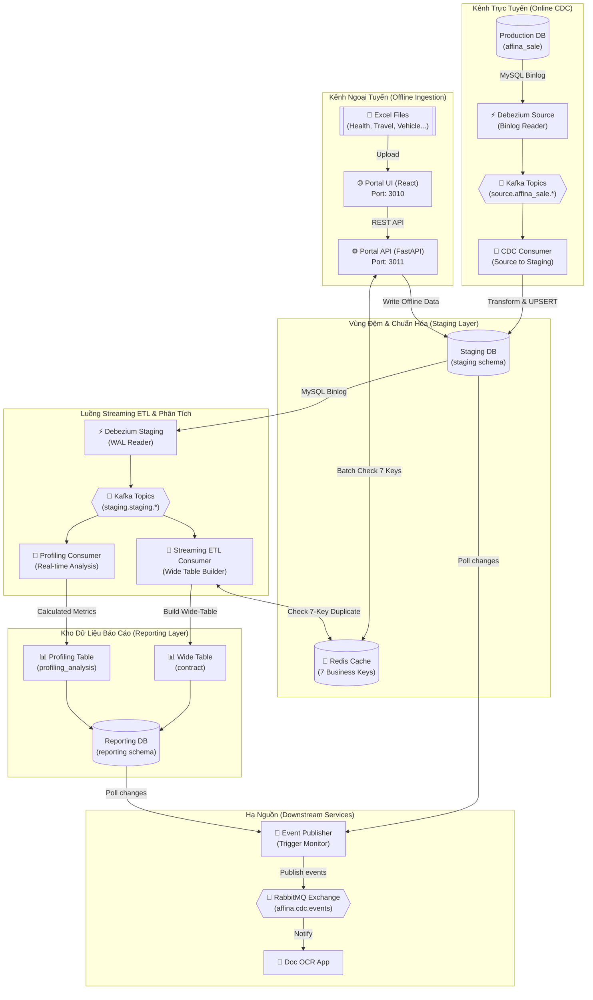

# Hybrid Data Ingestion & Streaming ETL Platform

[](https://www.python.org/)
[](https://react.dev/)
[](https://fastapi.tiangolo.com/)
[](https://kafka.apache.org/)
[](https://www.docker.com/)

Một nền tảng kỹ nghệ dữ liệu doanh nghiệp (Enterprise Data Engineering Platform) kết hợp hài hòa giữa **Luồng sự kiện thời gian thực (Online Real-time CDC)** và **Cổng tải lên ngoại tuyến (Offline Batch Ingestion)**. Hệ thống tự động đồng bộ, chuẩn hóa dữ liệu từ các nguồn khác nhau vào một kho lưu trữ báo cáo tập trung (Wide Table) với cơ chế chống trùng lặp hiệu năng cao dựa trên Redis.

---

## 🗺️ Kiến Trúc Hệ Thống (System Architecture)

Hệ thống được chia làm hai kênh nạp dữ liệu chính đồng bộ vào một database Staging trước khi thực hiện luồng ETL thời gian thực sang cơ sở dữ liệu Reporting:



---

## 📂 Cấu Trúc Dự Án (Monorepo Layout)

Dự án đã được tái cấu trúc thành một Mono-repo hoàn chỉnh để dễ dàng quản lý và triển khai:

```
hybrid-data-ingestion-platform/
├── configs/                     # Cấu hình đăng ký Debezium connectors
├── database/                    # SQL scripts khởi tạo các DB (Staging, Reporting)
├── docs/                        # Tài liệu hệ thống chi tiết
│   ├── portal/                  # Tài liệu hướng dẫn sử dụng và triển khai Portal
│   ├── PROJECT_FLOW.md          # Chi tiết luồng đi dữ liệu của hệ thống
│   └── SYSTEM_WORKFLOW.md       # Sơ đồ và logic nghiệp vụ tổng thể
├── services/                    # TẤT CẢ các microservice chạy trong hệ thống
│   ├── cdc_consumer/            # Consumer đồng bộ DB Source -> DB Staging
│   ├── event_publisher/         # Dịch vụ thông báo thay đổi qua RabbitMQ
│   ├── profiling/               # Consumer phân tích hành vi khách hàng real-time
│   ├── shared/                  # Thư viện Python dùng chung (logger, db connection)
│   ├── streaming_etl/           # Consumer đồng bộ DB Staging -> DB Reporting
│   ├── portal_backend/          # FastAPI Backend tiếp nhận tệp Excel ngoại tuyến
│   └── portal_frontend/         # React + TypeScript Frontend cho người dùng
├── docker-compose.kafka.yml     # Quản lý Zookeeper, Kafka và Kafka-UI
├── docker-compose.redis.yml     # Quản lý Redis và Redis Commander (UI)
├── docker-compose.rabbitmq.yml  # Quản lý RabbitMQ và Management Console
├── docker-compose.debezium.yml  # Quản lý Debezium Connect và Debezium-UI
├── docker-compose.consumer.yml  # Quản lý CDC Consumer & Event Publisher
├── docker-compose.streaming-etl.yml # Quản lý Streaming ETL Consumer
├── docker-compose.profiling.yml # Quản lý Profiling Consumer
├── docker-compose.portal.yml    # Quản lý Portal Frontend & Backend
├── .gitignore                   # Cấu hình bỏ qua tệp tin rác chung ở root
├── .env.example                 # Mẫu cấu hình tham số môi trường
└── README.md                    # Hướng dẫn chạy và tổng quan dự án (Tài liệu này)
```

---

## ⚡ Điểm Nhấn Kỹ Thuật & Design Patterns

### 1. OOP Design Patterns trong Portal Backend
Để xử lý động nhiều biểu mẫu Excel bảo hiểm khác nhau (Sức khỏe, Xe cơ giới, Du lịch...), hệ thống áp dụng các mẫu thiết kế hướng đối tượng chặt chẽ:
*   **Factory Pattern (`ProcessorFactory`)**: Tự động nhận diện loại bảo hiểm từ tên tệp hoặc yêu cầu của người dùng để khởi tạo processor phù hợp.
*   **Strategy Pattern (`IInsuranceProcessor`)**: Quy định các phương thức chuẩn hóa và kiểm tra dữ liệu bắt buộc cho từng loại bảo hiểm.
*   **Template Method Pattern**: Định nghĩa quy trình xử lý Excel gồm 4 bước cố định: `parse_excel()` $\rightarrow$ `pre_process()` $\rightarrow$ `transform()` $\rightarrow$ `post_process()`.

### 2. Double CDC Layer
Hệ thống sử dụng **Debezium** để đọc log nhị phân (MySQL binlog) ở hai cấp độ riêng biệt, tách rời luồng dữ liệu thô (Source) khỏi luồng dữ liệu tổng hợp (Reporting) nhằm nâng cao hiệu năng và độ ổn định.

### 3. Redis Deduplication Cache (7 Business Keys)
Nhằm ngăn chặn dữ liệu ngoại tuyến (Offline Excel) ghi đè lên dữ liệu trực tuyến (Online CDC) theo nguyên tắc **Online Wins**, hệ thống thực hiện kiểm tra trùng lặp thời gian thực với độ phức tạp $O(1)$ thông qua Redis bằng cách kết hợp 7 khóa định danh nghiệp vụ:
```
contract:dedup:{contractId}:{name}:{majorName}:{companyProviderName}:{startDate}:{endDate}:{feeInsurance}
```

---

## 🚀 Hướng Dẫn Triển Khai (Deployment Guide)

### 📋 Yêu cầu hệ thống
*   Docker & Docker Compose (v2.x trở lên)
*   Python 3.11 (nếu chạy local)
*   Node.js 20+ (nếu chạy local)

### Bước 1: Thiết Lập Tham Số Môi Trường
Sao chép tệp cấu hình mẫu và chỉnh sửa các tham số kết nối cơ sở dữ liệu thực tế:
```powershell
cp .env.example .env
```
*(Cập nhật các giá trị như `MYSQL_HOST`, `MYSQL_USER`, `MYSQL_PASSWORD` khớp với môi trường của bạn).*

---

### Bước 2: Khởi Tạo Cơ Sở Dữ Liệu
Chạy lần lượt các script SQL nằm trong thư mục `database/` để tạo các bảng lưu trữ cho Staging và Reporting:
```powershell
# 1. Tạo Database Staging và các bảng trực tuyến
database\01_staging\01_create_staging_schema.sql

# 2. Tạo bảng chứa dữ liệu Offline từ Excel
database\01_staging\02_create_staging_offline_contract.sql

# 3. Tạo bảng dữ liệu báo cáo tập trung (Wide Table) và phân tích hành vi
database\02_reporting\02_create_contract_wide_table.sql
database\02_reporting\create_profiling_analysis.sql
```

---

### Bước 3: Khởi Động Docker Infrastructure
Tạo mạng Docker dùng chung và kích hoạt các dịch vụ cơ sở hạ tầng:
```powershell
# Tạo network dùng chung cho toàn bộ dự án
docker network create cdc-network

# Khởi chạy Redis & Redis Commander (Port 6379, UI: 8081)
docker compose -f docker-compose.redis.yml up -d

# Khởi chạy Kafka, Zookeeper & Kafka-UI (Kafka: 9092, UI: 8080)
docker compose -f docker-compose.kafka.yml up -d

# Khởi chạy Debezium Connect & UI (Debezium: 8083, UI: 8084)
docker compose -f docker-compose.debezium.yml up -d

# Khởi chạy RabbitMQ (RabbitMQ: 5672, Management: 15672)
docker compose -f docker-compose.rabbitmq.yml up -d
```

---

### Bước 4: Đăng Ký Debezium Connectors
Đăng ký các tác vụ lắng nghe thay đổi MySQL binlog cho Debezium:
```powershell
# Đăng ký connector đọc dữ liệu từ database Source
Invoke-RestMethod -Uri "http://localhost:8083/connectors" `
  -Method Post `
  -ContentType "application/json" `
  -Body (Get-Content register-source-connector.json -Raw)

# Đăng ký connector đọc dữ liệu từ database Staging
Invoke-RestMethod -Uri "http://localhost:8083/connectors" `
  -Method Post `
  -ContentType "application/json" `
  -Body (Get-Content register-staging-connector.json -Raw)
```

---

### Bước 5: Triển Khai các Consumers và Event Publisher
Khởi động toàn bộ luồng xử lý và đồng bộ dữ liệu tự động:
```powershell
# Khởi chạy CDC Consumer (Source -> Staging)
docker compose -f docker-compose.consumer.yml up -d --build

# Khởi chạy Streaming ETL Consumer (Staging -> Reporting Wide-Table)
docker compose -f docker-compose.streaming-etl.yml up -d --build

# Khởi chạy Profiling Consumer (Tính toán chỉ số phân tích real-time)
docker compose -f docker-compose.profiling.yml up -d --build

# Khởi chạy Event Publisher (Push sự thay đổi sang RabbitMQ)
docker compose -f docker-compose.consumer.yml up -d event_publisher
```

---

### Bước 6: Khởi Động Cổng Portal Upload (Ngoại tuyến)
Kích hoạt cổng Portal tiếp nhận Excel để đưa dữ liệu ngoại tuyến vào hệ thống Staging:
```powershell
# Khởi chạy Frontend React và Backend FastAPI
docker compose -f docker-compose.portal.yml up -d --build
```
*   **Frontend Web UI**: [http://localhost:3010](http://localhost:3010)
*   **Backend REST API**: [http://localhost:3011](http://localhost:3011)

---

### Bước 7: Khởi Tạo Bộ Nhớ Đệm Chống Trùng Lặp (Redis Cache)
Sau khi toàn bộ dịch vụ đã trực tuyến, tiến hành xây dựng Redis Cache từ dữ liệu Online hiện có để phục vụ tính năng chống trùng lặp khi người dùng upload Excel:
```powershell
docker exec -it cdc_portal_backend python -c "from services.duplicate_service import DuplicateService; print('Redis builder running...')"
# Hoặc chạy trực tiếp script build cache từ Container Streaming ETL
docker exec -it affina_streaming_etl python redis_cache_builder.py
```

---

## 🛠️ Hướng Dẫn Giám Sát & Logs
*   **Theo dõi logs hệ thống**: `docker compose -f docker-compose.<service>.yml logs -f`
*   **Trực quan hóa Topic Kafka**: Truy cập [http://localhost:8080](http://localhost:8080)
*   **Trực quan hóa Debezium Connectors**: Truy cập [http://localhost:8084](http://localhost:8084)
*   **Quản lý Redis Keys**: Truy cập [http://localhost:8081](http://localhost:8081)
*   **Quản lý Hàng đợi RabbitMQ**: Truy cập [http://localhost:15672](http://localhost:15672) (User: `guest`, Password: `guest`)
