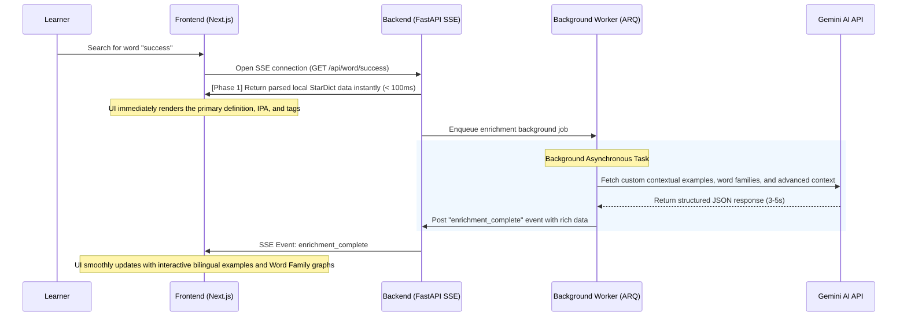

<div>
  
</div>

<div align="center">
  <strong>English</strong> | <a href="README_VI.md">Tiếng Việt</a>
</div>

<h3 align="center">An optimized English vocabulary learning platform for Vietnamese learners</h3>

<div align="center">
  
  
  
  
  
</div>

---

## 📌 Table of Contents

1. [Project Overview](#-project-overview)
2. [System Architecture](#-system-architecture)
3. [Core Features](#-core-features)
4. [Tech Stack](#-tech-stack)
5. [Directory Structure](#-directory-structure)
6. [Quick Start Guide](#-quick-start-guide)
7. [Google OAuth Configuration](#-google-oauth-configuration)
8. [Storybook & Development Tooling](#-storybook--development-tooling)
9. [Architecture Decision Records (ADR)](#-architecture-decision-records-adr)
10. [Troubleshooting](#-troubleshooting)

---

## 🌟 Project Overview

**WordMesh** is designed to solve a ubiquitous problem for language learners: **looking up a word only to forget it almost immediately**. Traditional dictionary tools stop at basic translation. WordMesh transforms this passive, fragmented lookup behavior into a unified, scientifically backed active learning workflow.

*   **Vision:** Turn every vocabulary lookup into a meaningful, long-term learning moment.
*   **The Problem:** Learners lookup words dynamically as they read or watch content, but retention is poor because typical dictionaries offer raw translations without immediate context or systematic retention mechanisms.
*   **Our Approach:** WordMesh seamlessly integrates three key pillars: **Instant Traversal Lookup** $\rightarrow$ **AI-Driven Contextual Enrichment** $\rightarrow$ **Scientific Spaced Repetition Review**.
*   **The Result:** Clear, instant comprehension today, reinforced memory retention forever.

---

## 🏗️ System Architecture

The codebase is built using an asynchronous, event-driven architecture designed to ensure a seamless and responsive user experience. Heavy computation or third-party API calls are completely decoupled from the initial user response.

### High-Level Request Flow

```
Next.js UI ──(Word Search)──> FastAPI API ──(Instant StarDict Parse)──> Instant UI Render
                                  │
                       (Enqueue Async Job)
                                  ▼
                            Redis / ARQ ──(Gemini AI / External APIs)──> Save to DB & Stream via SSE
```

### Progressive Loading Pipeline (Server-Sent Events)

To prevent users from waiting 5-8 seconds for Gemini AI responses, WordMesh implements a highly responsive 2-phase progressive streaming system utilizing **Server-Sent Events (SSE)**:



---

## ✨ Core Features

### 1. Structured StarDict Parser
*   **The Problem:** Open-source StarDict files contain unorganized text blocks (a "wall of text") with inconsistent metadata.
*   **Our Solution:** A custom python parsing engine splits raw dictionary files into pristine JSON components.
*   **Rich Display:** Formats definitions clearly with indices, visual parts of speech (POS) badges, **CEFR difficulty levels (A1-C2)**, clean bilingual example splits, and interactive synonym/antonym pill tags.

### 2. Progressive Enrichment via SSE
*   Delivers local dictionary data in less than 100ms for instant feedback.
*   Background threads progressively streams advanced enrichments (audio pronunciations, related idioms, structural collocations, and AI-enriched Word Family nodes) over Server-Sent Events without locking the interface.

### 3. FSRS Spaced Repetition Engine
*   Integrates the state-of-the-art **FSRS (Free Spaced Repetition Scheduler)** algorithm, widely regarded as the most advanced spaced repetition model (outperforming SM-2).
*   Automatically predicts your forgetting curve and schedules flashcard reviews at the absolute optimal moment, maximizing memory consolidation.

### 4. Seamless Guest-to-User Migration
*   Frictionless discovery: Users can lookup and save words as a **Guest** without credentials.
*   Upon logging in with **Google OAuth**, the system instantly consolidates and migrates local guest history into the user's secure cloud database seamlessly.

---

## 💻 Tech Stack

### Frontend
<div align="left">
  
  
  
  
  
  
  
  
  
</div>

*   **Next.js 16 (App Router):** Robust server component rendering and SEO optimization.
*   **TypeScript:** Type safety across large components.
*   **Tailwind CSS:** Modern, responsive "Warm Precision" styling featuring custom, hardware-accelerated dark mode transitions.
*   **Zod & @t3-oss/env-nextjs:** Strict build-time environment variable schema validations.

### Backend & Infrastructure
<div align="left">
  
  
  
  
  
  
  
  
  
  
  
  
  
</div>

*   **FastAPI:** High-performance asynchronous REST API.
*   **ARQ & Redis:** Fast asynchronous task distribution and in-memory message broker.
*   **PostgreSQL 16:** Robust, ACID-compliant transactional database accessed via SQLAlchemy ORM.
*   **Meilisearch:** Blazing-fast full-text search engine serving instant autocomplete queries.
*   **Alembic:** Database migration management.
*   **Docker & Docker Compose:** Standardized dev and production environments.

---

## 📂 Directory Structure

```
wordmesh-vocab-builder/
├── backend/                  # FastAPI Backend codebase
│   ├── app/
│   │   ├── api/              # API Route controllers (auth, words, cards...)
│   │   ├── models/           # SQLAlchemy DB schema models
│   │   ├── schemas/          # Pydantic data schemas
│   │   ├── services/         # Core business logic (FSRS scheduling, Gemini AI...)
│   │   └── utils.py          # Parsing utilities
│   ├── worker.py             # Async ARQ background worker
│   └── alembic/              # Database migration records
├── frontend/                 # Next.js 16 Frontend codebase
│   ├── app/                  # Next.js App Router structure
│   ├── components/           # Reusable UI component library
│   ├── hooks/                # Custom React Hooks (SSE client, auth context...)
│   ├── lib/                  # Shared utility methods (API clients, env schemas...)
│   └── stories/              # Storybook components documentation
├── docs/                     # Architectural & system documentation
│   ├── adr/                  # Architecture Decision Records
│   ├── PRD.md                # Product Requirements Document
│   └── DESIGN.md             # Detailed Technical Design Document
├── docker-compose.dev.yml    # Development environment config (Hot-reload)
└── docker-compose.prod.yml   # Production-like docker stack
```

---

## 🚀 Quick Start Guide

### 📋 Prerequisites
*   **Docker** & **Docker Compose** installed.
*   A **Gemini API Key** (Get one for free at Google AI Studio).

### Step 1: Initialize Environment
1. Copy the environment configuration template from the backend directory:
   ```powershell
   # Windows (PowerShell)
   Copy-Item backend/.env.example .env
   
   # macOS/Linux (Bash)
   cp backend/.env.example .env
   ```
2. Open `.env` in your editor and configure the necessary variables:
   ```env
   GEMINI_API_KEY=your_gemini_api_key_here
   GOOGLE_CLIENT_ID=your_google_client_id
   GOOGLE_CLIENT_SECRET=your_google_client_secret
   JWT_SECRET=generate_a_random_secure_string_here
   ```

### Step 2: Build & Start Services (Development)
Spin up the entire local development stack (frontend with hot-reload, backend, worker, database, search engine):
```bash
docker compose -f docker-compose.dev.yml up --build
```

### Step 3: Run Database Migrations
Once the backend and database containers are online and running, open another terminal window and execute:
```bash
docker compose -f docker-compose.dev.yml exec backend alembic upgrade head
```

### Step 4: Access URLs
*   **User Interface (Frontend):** [http://localhost:3000](http://localhost:3000)
*   **Core API (Backend):** [http://localhost:18000](http://localhost:18000)
*   **API Docs (Swagger UI):** [http://localhost:18000/docs](http://localhost:18000/docs)
*   **System Health Check:** [http://localhost:18000/health](http://localhost:18000/health)
*   **Meilisearch Engine Console:** [http://localhost:7700](http://localhost:7700)

### Production-like Local Run
To build, compile, and run the optimized production container stack in the background:
```bash
docker compose -f docker-compose.prod.yml up --build -d
```

---

## 🔑 Google OAuth Configuration

To support social authentication on local environments, configure your app inside the **Google Cloud Console** with these settings:

*   **Authorized JavaScript origins:**
    *   `http://localhost:3000`
*   **Authorized redirect URIs:**
    *   `http://localhost:18000/api/auth/google/callback`

> [!NOTE]  
> WordMesh utilizes a unified auth logic: If the authenticated email is not found, a new account is registered automatically; otherwise, the user is logged in, instantly migrating previous Guest data items to their account.

---

## 🎨 Storybook & Development Tooling

WordMesh provides a complete modern developer toolchain to maintain a high-quality codebase:

### 1. Isolated Component Explorer (Storybook 10)
Build, iterate, and document UI components in complete isolation without running the database or API layers:
*   Start the Storybook dev server:
    ```bash
    cd frontend
    npm run storybook
    ```
*   Open the explorer dashboard at: [http://localhost:6006](http://localhost:6006)
*   Interactive stories for core components like `Button` and `CefrBadge` are fully documented with WCAG accessibility validation checks.

### 2. Next.js Bundle Analyzer
Easily identify and optimize large bundle sizes to preserve performance:
```bash
cd frontend
npm run analyze
```
This builds your application and launches interactive dependency maps in your browser.

### 3. Smooth Transitions
UI switches dynamically between light and dark modes with hardware-accelerated CSS transitions (0.3s ease) preventing jarring transitions (FOUC).

---

## 🏛️ Architecture Decision Records (ADR)

WordMesh documents its architectural journey using **ADR (Architecture Decision Records)** to maintain codebase transparency and onboarding ease.

Review the full set of technical ADRs inside [docs/adr/README.md](file:///d:/project/wordmesh-vocab-builder/docs/adr/README.md):

*   **[ADR-001](file:///d:/project/wordmesh-vocab-builder/docs/adr/ADR-001-frontend-framework-selection.md):** Frontend Framework Selection (Next.js 16 Selection)
*   **[ADR-002](file:///d:/project/wordmesh-vocab-builder/docs/adr/ADR-002-backend-framework-selection.md):** Backend Framework Selection (FastAPI Asynchronous Layer)
*   **[ADR-003](file:///d:/project/wordmesh-vocab-builder/docs/adr/ADR-003-database-and-search-engine.md):** Database and Search Engine Hybrid Topology
*   **[ADR-004](file:///d:/project/wordmesh-vocab-builder/docs/adr/ADR-004-state-management-strategy.md):** Client-Side State Management Design
*   **[ADR-005](file:///d:/project/wordmesh-vocab-builder/docs/adr/ADR-005-environment-variable-validation.md):** Type-Safe Env Validation via Zod Schemas
*   **[ADR-006](file:///d:/project/wordmesh-vocab-builder/docs/adr/ADR-006-component-documentation-storybook.md):** UI Playground Standard with Storybook 10
*   **[ADR-007](file:///d:/project/wordmesh-vocab-builder/docs/adr/ADR-007-dark-mode-implementation.md):** Smooth Transitions & Theme Persistence Design

---

## 🛠️ Troubleshooting

*   **Issue: `OAuth callback Not Found (404)`**
    *   *Root cause:* Misconfigured Redirect URI on Google Cloud Console, or backend was not restarted to reload the environment variables.
    *   *Fix:* Double check that your Authorized Redirect URI exactly matches `http://localhost:18000/api/auth/google/callback` and restart the backend docker container.
*   **Local changes do not reflect in the browser?**
    *   *Root cause:* You might be running the production docker compose stack (`docker-compose.prod.yml`) which serves pre-compiled bundles.
    *   *Fix:* Spin down the active containers and boot the dev stack instead using `docker-compose.dev.yml` to re-enable hot-reload.
*   **Missing package errors or import failures after pulling updates?**
    *   *Root cause:* Frontend dependencies are out-of-sync or Python's environment cache is referencing outdated package trees.
    *   *Fix:* Restart your containers using the build flag: `docker compose -f docker-compose.dev.yml up --build`. If that fails, wipe volumes clean via `docker compose down -v` and restart.

---

## 🔗 Useful Documentation Links
*   **Product Requirements:** [docs/PRD.md](file:///d:/project/wordmesh-vocab-builder/docs/PRD.md)
*   **Technical Design Document:** [docs/DESIGN.md](file:///d:/project/wordmesh-vocab-builder/docs/DESIGN.md)
*   **Milestone & Implementation Summary:** [docs/implementation_summary.md](file:///d:/project/wordmesh-vocab-builder/docs/implementation_summary.md)

---

<div>
  
</div>