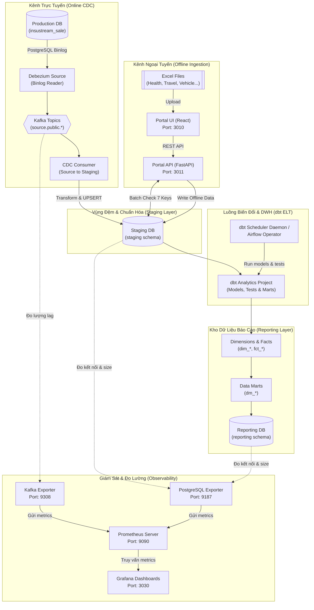

<div>
  
</div>

<div align="center">
  <strong>Vietnamese</strong> | <a href="README.md">English</a>
</div>

<h3 align="center">Nền tảng kỹ nghệ dữ liệu doanh nghiệp kết hợp luồng sự kiện thời gian thực (CDC) và tải lên Excel ngoại tuyến</h3>

<div align="center">
  
  
  
  
  
  
</div>

---

## Mục Lục

1. [Tổng Quan Dự Án](#tong-quan-du-an)
2. [Kiến Trúc Hệ Thống & Luồng Dữ Liệu](#kien-truc-he-thong--luong-du-lieu)
3. [Điểm Nhấn Tính Năng](#diem-nhan-tinh-nang)
4. [Hiệu Năng & Số Liệu Đo Lường](#hieu-nang--so-lieu-do-luong)
5. [Công Nghệ Sử Dụng](#cong-nghe-su-dung)
6. [Cấu Trúc Thư Mục](#cau-truc-thu-muc)
7. [Hướng Dẫn Khởi Chạy Nhanh](#huong-dan-khoi-chay-nhanh)
8. [Giám Sát & Quan Sát Hệ Thống](#giam-sat--quan-sat-he-thong)
9. [Xử Lý Sự Cố](#xu-ly-su-co)

---

## Tổng Quan Dự Án

Dự án này xây dựng một hệ thống tích hợp dữ liệu lai (**Hybrid Data Ingestion & Streaming ETL Platform**) phục vụ quản lý hợp đồng bảo hiểm. Hệ thống kết hợp hài hòa hai kênh dữ liệu khác biệt về bản chất:
1. **Luồng trực tuyến thời gian thực (Online Real-time CDC)**: Tự động ghi nhận mọi sự kiện thay đổi dữ liệu (INSERT, UPDATE, DELETE) trên Database nguồn của hệ thống bán hàng.
2. **Cổng tải lên ngoại tuyến (Offline Batch Ingestion Portal)**: Cho phép các đối tác hoặc quản trị viên upload trực tiếp file Excel báo cáo hợp đồng thô.

Mục tiêu cốt lõi của hệ thống là tự động thu thập, kiểm tra trùng lặp chéo, chuẩn hóa và xây dựng kho dữ liệu phân tích tập trung (**Star Schema**) giúp doanh nghiệp có cái nhìn toàn diện và chính xác nhất về hoạt động kinh doanh.

### Giao Diện Quản Lý Portal (Excel Upload UI)


---

## Kiến Trúc Hệ Thống & Luồng Dữ Liệu

Kiến trúc hệ thống được đóng gói hoàn chỉnh bằng Docker Containers, đảm bảo luồng dữ liệu trơn tru từ nguồn đến tầng báo cáo.

### Sơ Đồ Quy Trình Hoạt Động (Project Workflow)


### Chi Tiết Kênh Nạp & Biến Đổi Dữ Liệu


---

## Điểm Nhấn Tính Năng

### 1. Xử Lý Excel Bằng Design Patterns
Portal Backend được viết bằng FastAPI áp dụng các mẫu thiết kế hướng đối tượng:
*   **Factory Pattern (`ProcessorFactory`)**: Nhận diện loại bảo hiểm từ file tải lên để chọn bộ xử lý chuyên biệt.
*   **Strategy Pattern (`IInsuranceProcessor`)**: Chuẩn hóa cấu trúc và kiểu dữ liệu độc lập cho từng nghiệp vụ (Xe máy, Xe ô tô, Sức khỏe, Du lịch...).
*   **Template Method Pattern**: Cố định quy trình xử lý 4 bước: `parse_excel()` $\rightarrow$ `pre_process()` $\rightarrow$ `transform()` $\rightarrow$ `post_process()`.

### 2. Cơ Chế Khử Trùng Lặp Chéo (SQL & dbt)
Nhằm ngăn chặn dữ liệu tải lên thủ công (Offline Excel) ghi đè lên dữ liệu chính thống (Online CDC) theo nguyên tắc **Online Wins**:
*   **Tại API (Staging Level)**: Portal Backend truy vấn trực tiếp cơ sở dữ liệu Staging để kiểm tra trùng lặp thông qua batch query. Nếu 7 trường nghiệp vụ cốt lõi trùng khớp, bản ghi sẽ bị loại ngay từ đầu.
*   **Tại dbt (ELT Level)**: Model `int_contracts_deduped.sql` thực hiện phép `ROW_NUMBER() OVER (PARTITION BY 7_business_keys ORDER BY online_first)` để lọc trùng chéo chót chặn, ưu tiên dòng dữ liệu trực tuyến.

7 Khóa nghiệp vụ cốt lõi:
```
{contractId} + {peopleName} + {majorName} + {companyProviderName} + {startDate} + {endDate} + {feeInsurance}
```

### 3. Trực Quan Hóa Trạng Thái Tải Lên Excel
Hệ thống hiển thị trực quan các kịch bản kết quả xử lý dữ liệu khác nhau trên Portal UI:

````carousel

<!-- slide -->

<!-- slide -->

````

---

## Hiệu Năng & Số Liệu Đo Lường

Các chỉ số hiệu năng đo trên môi trường Docker cục bộ (8 vCPU, 16 GB RAM):

| Chỉ số | Giá trị | Mô tả |
|--------|---------|-------|
| **Online CDC Throughput** | ~500 sự kiện/giây (đỉnh) | Debezium bắt WAL events, Kafka đệm, Consumer ghi vào staging |
| **Offline Batch Throughput** | ~50,000 bản ghi/lần upload | Excel được xử lý qua FastAPI + Pandas trong một API call |
| **End-to-End CDC Latency** | < 1.5 giây | Từ lúc ghi DB production đến lúc hiện diện tại bảng staging |
| **Tỉ lệ khử trùng** | ~18% dữ liệu offline | Bản ghi bị loại bởi 7 business keys chéo kênh |
| **dbt Incremental Run** | ~8 giây | Chỉ xử lý dữ liệu mới/thay đổi kể từ lần chạy trước |
| **dbt Full-Refresh Run** | ~45 giây | Xây dựng lại toàn bộ bảng warehouse và mart từ đầu |
| **dbt Test Coverage** | 54 tests trên 3 tầng | Staging (source + model), Warehouse (dim + fact), Mart |
| **Kafka Consumer Lag** | < 50 messages (trạng thái ổn định) | Đo qua Kafka Exporter + Dashboard Grafana |

> **Ghi chú**: Số liệu dựa trên tập dữ liệu ~120,000 hợp đồng và ~8,000 claim. Môi trường production với khả năng mở rộng ngang (nhiều Kafka partition + consumer instances) có thể đạt throughput cao hơn đáng kể.

---

## Công Nghệ Sử Dụng

### Giao Diện (Frontend)
<div align="left">
  
  
  
  
  
</div>

*   **React 18 & TypeScript**: Xây dựng UI hướng thành phần (Component-driven UI), quản lý trạng thái tải lên chặt chẽ.
*   **Tailwind CSS & Vanilla CSS**: Đảm bảo giao diện hiện đại, responsive và trực quan.

### Phân Tích & Phía Máy Chủ (Backend & Analytics)
<div align="left">
  
  
  
  
  
  
  
  
  
  
  
  
  
  
  
</div>

*   **FastAPI & SQLAlchemy ORM**: Tiếp nhận và xử lý file Excel dạng luồng bất đồng bộ.
*   **Kafka & Debezium**: Theo dõi sự kiện thay đổi dữ liệu ở cơ sở dữ liệu nguồn trực tiếp.
*   **dbt Core**: Thực hiện ELT gia tăng (Incremental models) chuẩn hóa dữ liệu sang Star Schema.
*   **PostgreSQL 16**: Đóng vai trò là Production DB, Staging DB và Reporting Data Warehouse.

---

## Cấu Trúc Thư Mục

```
hybrid-data-ingestion-platform/
├── configs/                         # Cấu hình đăng ký Debezium connectors
├── database/                        # SQL scripts khởi tạo các DB (Staging, Reporting)
├── docs/                            # Tài liệu đặc tả hệ thống & hướng dẫn
│   ├── images/                      # Hình ảnh giao diện & luồng hoạt động
│   ├── AIRFLOW_MIGRATION_GUIDE.md   # Kế hoạch di chuyển sang Airflow DAG
│   ├── PROJECT_ARCHITECTURE.md      # Chi tiết kiến trúc và luồng dữ liệu
│   └── DEPLOYMENT_GUIDE.md          # Hướng dẫn triển khai từng bước
├── monitoring/                      # Cấu hình stack quan sát hệ thống
│   ├── prometheus/prometheus.yml    # Cấu hình scrape targets Prometheus
│   └── grafana/                     # Grafana provisioning và dashboards
│       ├── provisioning/            # Datasources và dashboard providers tự động
│       └── dashboards/              # Dashboard JSON định nghĩa sẵn
├── services/                        # Các dịch vụ độc lập của hệ thống
│   ├── cdc_consumer/                # Consumer đồng bộ DB Source -> DB Staging
│   ├── dbt_analytics/               # Project dbt (Transformations, DWH, Data Marts)
│   ├── shared/                      # Thư viện Python dùng chung (logger, db connections)
│   ├── portal_backend/              # FastAPI Backend tiếp nhận tệp Excel ngoại tuyến
│   └── portal_frontend/             # React + TypeScript Frontend cho người dùng
├── docker-compose.kafka.yml         # Quản lý Zookeeper, Kafka và Kafka-UI
├── docker-compose.debezium.yml      # Quản lý Debezium Connect và Debezium-UI
├── docker-compose.consumer.yml      # Quản lý CDC Consumer
├── docker-compose.scheduler.yml     # Quản lý dbt Scheduler Daemon
├── docker-compose.portal.yml        # Quản lý Portal Frontend & Backend
├── docker-compose.monitoring.yml    # Quản lý Prometheus, Grafana và Exporters
├── .env.example                     # Mẫu cấu hình tham số môi trường
└── README.md                        # Hướng dẫn tổng quan dự án
```

---

## Hướng Dẫn Khởi Chạy Nhanh

### Yêu cầu tiên quyết
*   Đã cài đặt **Docker** và **Docker Compose**.
*   Một hệ cơ sở dữ liệu PostgreSQL đang chạy (hoặc dùng Docker).

### Bước 1: Sao chép tệp tham số môi trường
1. Sao chép tệp mẫu cấu hình môi trường:
   ```powershell
   # Windows (PowerShell)
   Copy-Item .env.example .env
   
   # macOS/Linux (Bash)
   cp .env.example .env
   ```
2. Cập nhật các tham số cấu hình kết nối DB và Kafka phù hợp với máy của bạn.

### Bước 2: Tạo Mạng Docker Dùng Chung
Khởi tạo mạng nội bộ dùng chung cho toàn bộ stack dự án:
```bash
docker network create cdc-network
```

### Bước 3: Khởi chạy cơ sở hạ tầng
```bash
# 1. Khởi chạy cơ sở dữ liệu (Nguồn & Đích)
docker compose -f docker-compose.db.yml up -d

# 2. Khởi chạy Kafka Cluster & UI
docker compose -f docker-compose.kafka.yml up -d

# 3. Khởi chạy Debezium Connector
docker compose -f docker-compose.debezium.yml up -d
```
*Đợi khoảng 15-20 giây để các dịch vụ khởi động hoàn toàn.*

### Bước 4: Đăng Ký Debezium Connectors
Đẩy tệp cấu hình JSON đăng ký theo dõi thay đổi bảng lên Debezium:
```powershell
# Windows (PowerShell)
Invoke-RestMethod -Uri "http://localhost:8083/connectors" `
  -Method Post `
  -ContentType "application/json" `
  -Body (Get-Content configs\register-source-connector.json -Raw)
```

### Bước 5: Chạy các Services & Portal
```bash
# 1. Khởi chạy CDC Consumer (Kafka -> Staging DB)
docker compose -f docker-compose.consumer.yml up -d --build

# 2. Khởi chạy dbt Scheduler (Chạy dbt transform định kỳ 5 phút)
docker compose -f docker-compose.scheduler.yml up -d --build

# 3. Khởi chạy Portal FE & BE
docker compose -f docker-compose.portal.yml up -d --build
```

---

## Giám Sát & Quan Sát Hệ Thống

Nền tảng tích hợp stack giám sát đầy đủ gồm **Prometheus** và **Grafana** để theo dõi thời gian thực Kafka consumer lag, PostgreSQL health, và throughput nạp dữ liệu.

### Giao Diện Dashboard CDC Platform Overview


### Khởi Chạy Monitoring Stack
```bash
docker compose -f docker-compose.monitoring.yml up -d
```

### Bảng Điều Khiển & Giao Diện
| Dịch vụ | URL | Mục đích |
|---------|-----|----------|
| **Grafana** | [http://localhost:3030](http://localhost:3030) | Dashboard tổng quan CDC Platform (Kafka lag, DB stats) |
| **Prometheus** | [http://localhost:9090](http://localhost:9090) | Truy vấn metrics thô |
| **Kafka-UI** | [http://localhost:8080](http://localhost:8080) | Giám sát topics và consumer groups |
| **Debezium-UI** | [http://localhost:8084](http://localhost:8084) | Trạng thái hoạt động connectors |
| **Portal UI** | [http://localhost:3010](http://localhost:3010) | Giao diện tải lên tệp Excel |
| **Portal API Docs** | [http://localhost:3011/docs](http://localhost:3011/docs) | Swagger/OpenAPI endpoint explorer |

> Tài khoản Grafana mặc định: `admin` / `admin`

### Theo Dõi Logs Hệ Thống
```bash
docker compose -f docker-compose.<service>.yml logs -f
```

---

## Xử Lý Sự Cố

*   **Lỗi: `Debezium Connector không thể chạy (FAILED)`**
    *   *Nguyên nhân:* Database nguồn (`insure_production`) chưa được kích hoạt chế độ ghi log WAL level sang `logical`.
    *   *Khắc phục:* Thực thi câu lệnh SQL `ALTER SYSTEM SET wal_level = 'logical';` trên Database nguồn và khởi động lại DB.
*   **Lỗi: `Consumer không nhận được tin nhắn từ Kafka`**
    *   *Nguyên nhân:* Mạng `cdc-network` chưa khớp hoặc Kafka bootstrap server bị trỏ sai giữa môi trường container và localhost.
    *   *Khắc phục:* Đảm bảo biến `KAFKA_BOOTSTRAP_SERVERS` trong `.env` luôn được cấu hình là `kafka:9093` đối với container và `localhost:9092` đối với các process chạy local trực tiếp trên máy chủ.
*   **Đổi code local nhưng container không đổi?**
    *   *Khắc phục:* Khởi chạy lại docker compose với flag build để biên dịch lại ảnh: `docker compose -f docker-compose.<name>.yml up -d --build`.

---

<div>
  
</div>
