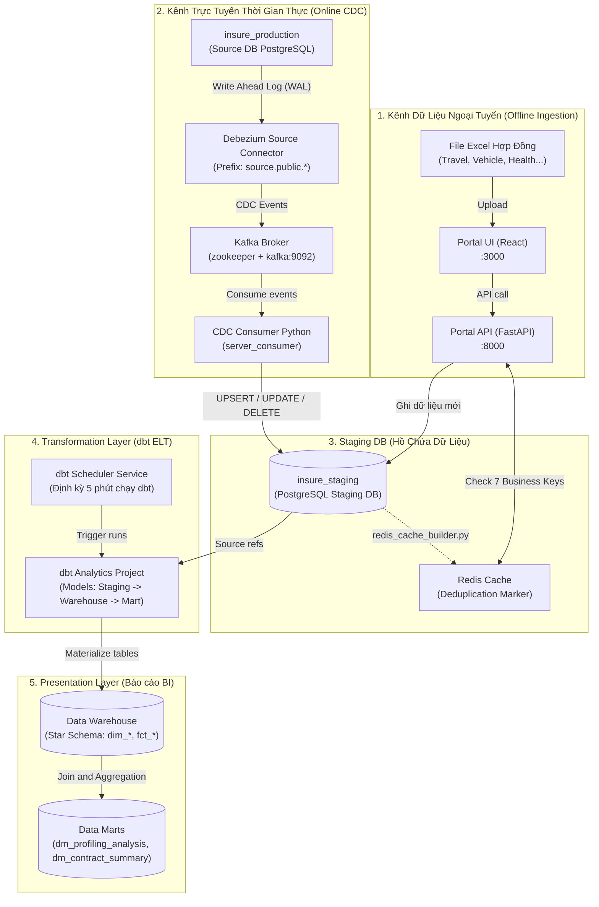

# Kiến Trúc Hệ Thống & Luồng Dữ Liệu (Project Architecture)

Hệ thống **Hybrid Data Ingestion & Streaming ETL Platform** là một nền tảng dữ liệu hiện đại tích hợp luồng dữ liệu trực tuyến thời gian thực (Online CDC) và luồng dữ liệu ngoại tuyến (Offline Excel Upload). Dự án áp dụng mô hình **Modern Data Stack (MDS)** sử dụng **dbt** để chuẩn hóa dữ liệu sang cấu trúc **Star Schema (Dimensional Modeling)**.

---

## 1. Sơ Đồ Kiến Trúc Tổng Thể (Architecture Flow)

Dưới đây là kiến trúc dòng chảy dữ liệu từ nguồn gốc tới kho dữ liệu báo cáo:



---

## 2. Các Cấu Phần Kỹ Thuật Chính

### 2.1. Online CDC & Consumer
- **Debezium**: Lắng nghe mọi thay đổi (INSERT, UPDATE, DELETE) trong database production (`insure_production`) từ file WAL, chuyển thành các JSON message chuẩn hóa và đẩy vào các topic tương ứng trên Kafka.
- **Python CDC Consumer**: Lắng nghe Kafka, định dạng lại kiểu dữ liệu của Debezium (như convert epoch timestamps) và ghi trực tiếp vào các bảng staging tương ứng.

### 2.2. Offline Ingestion & Chống Trùng Lặp (Deduplication)
- **Portal App (React/FastAPI)**: Cho phép tải lên các tệp Excel hợp đồng offline từ đối tác.
- **Nguyên tắc "Online Wins"**: Dữ liệu từ hệ thống chính thống (Online) luôn được ưu tiên cao hơn dữ liệu tải lên thủ công (Offline).
- **Cơ chế 7 Business Keys qua Redis**: Để chống trùng lặp chéo giữa 2 kênh, hệ thống sử dụng 7 trường nghiệp vụ để tạo mã định danh duy nhất (Business Key ID) và lưu trữ trên bộ nhớ đệm **Redis Cache ($O(1)$)**:
  1. `contractId` (Mã hợp đồng)
  2. `peopleName` (Tên khách hàng)
  3. `majorName` (Tên chương trình bảo hiểm)
  4. `companyProviderName` (Nhà cung cấp bảo hiểm)
  5. `startDate` (Ngày hiệu lực)
  6. `endDate` (Ngày hết hạn)
  7. `feeInsurance` (Phí bảo hiểm)

---

## 3. Mô Hình Dữ Liệu Data Warehouse (Star Schema)

Sau khi dữ liệu thô được đưa vào Staging, **dbt** sẽ tự động thực hiện quá trình ELT để chuyển đổi dữ liệu từ dạng bảng rộng thiếu nhất quán sang cấu trúc **Star Schema** tối ưu cho BI:

```
                  ┌─────────────────┐
                  │    dim_date     │
                  └────────┬────────┘
                           │ 1:N
                           ▼
  ┌─────────────────┐    ┌─────────────────┐    ┌───────────────────┐
  │  dim_customer   ├──1:N┤  fct_contracts  ├N:1┤dim_insured_person │
  └─────────────────┘    └────────┬────────┘    └───────────────────┘
                           N:1    │ N:1
  ┌─────────────────┐             ▼             ┌───────────────────┐
  │dim_sales_channel│◀────────────┴────────────▶│    dim_product    │
  └─────────────────┘                           └───────────────────┘
                                  ▲
                           1:N    │ 1:N
                         ┌────────┴────────┐
                         │   fct_claims    │
                         └─────────────────┘
```

### Bảng Chiều (Dimensions)
- `dim_date`: Khởi tạo tĩnh từ 2020-2030, hỗ trợ phân tích theo thứ tiếng Việt, quý, cuối tuần, cuối tháng.
- `dim_customer`: Thông tin về Người mua (Buyer) bảo hiểm.
- `dim_insured_person`: Thông tin về Người được bảo hiểm (Insured), chứa logic **decode mã thành phố** và **quan hệ gia đình** tập trung.
- `dim_product`: Thông tin chuẩn hóa về gói và chương trình bảo hiểm.
- `dim_sales_channel`: Kênh bán hàng (công ty, chi nhánh bán).

### Bảng Sự Kiện (Facts)
- `fct_contracts`: Lưu trữ chi tiết hợp đồng bảo hiểm theo từng đối tượng bảo hiểm (grain: 1 row = 1 contract object). Chỉ chứa FK keys và các thước đo (Premium fee, commission, amount).
- `fct_claims`: Lưu trữ các yêu cầu bồi thường (claim), tự động tính toán thời gian chờ duyệt, phân loại chẩn đoán y khoa (`common_diagnostic_category`).

### Tầng Báo Cáo (Data Marts)
- `dm_profiling_analysis`: Data Mart phục vụ phân tích hồ sơ bồi thường khách hàng (Customer Claim Profiling).
- `dm_contract_summary`: Data Mart phục vụ báo cáo tổng quan tình hình doanh thu và số lượng hợp đồng bảo hiểm bán ra.
