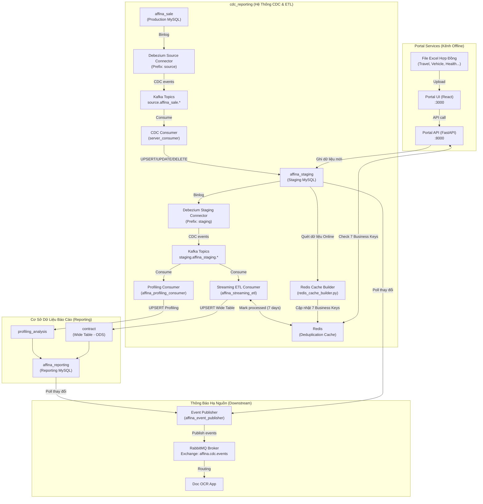

# Kiến Trúc Đồng Bộ và Luồng Hoạt Động Hệ Thống (System Workflow)

Tài liệu này mô tả chi tiết luồng công việc (workflow), cấu trúc kiến trúc và mối liên hệ chặt chẽ giữa hai dự án:
1. **Portal Services** (Cổng tải lên dữ liệu Excel Offline - `services/portal_frontend` (React) + `services/portal_backend` (FastAPI))
2. **`cdc_reporting`** (Hệ thống CDC trực tuyến và Streaming ETL - Python + Kafka + Redis + Debezium + RabbitMQ)

---

## 1. Sơ Đồ Luồng Dữ Liệu Tổng Thể (System Architecture)

Sự kết hợp giữa 2 dự án tạo nên một pipeline dữ liệu hoàn chỉnh, tích hợp cả kênh dữ liệu trực tuyến thời gian thực (Online CDC) và kênh dữ liệu ngoại tuyến (Offline Excel Upload) theo nguyên tắc đồng bộ nhất quán.

---

## 2. Chi Tiết Luồng Xử Lý Dự Án Portal (Excel Ingestion)

Dự án này là cổng tiếp nhận các file Excel hợp đồng từ các đại lý hoặc đối tác để đưa vào hệ thống dưới dạng dữ liệu ngoại tuyến (Offline).

### 2.1. Kiến Trúc và Các Design Pattern Áp Dụng
Để xử lý nhiều loại hình bảo hiểm khác nhau (Sức khỏe, Xe cơ giới, Du lịch, Tai nạn...), dự án áp dụng các mẫu thiết kế hướng đối tượng chặt chẽ:
*   **Factory Pattern (`ProcessorFactory`)**: Nhận diện loại bảo hiểm từ tên file hoặc người dùng chọn để khởi tạo đúng processor tương ứng (ví dụ: `TravelProcessor`, `VehicleProcessor`, `HealthProcessor`).
*   **Strategy Pattern (`IInsuranceProcessor`)**: Định nghĩa interface chung cho tất cả các loại bảo hiểm. Mỗi processor cụ thể sẽ thực hiện các quy tắc validate và làm sạch dữ liệu đặc thù.
*   **Template Method Pattern**: Quy định quy trình 4 bước xử lý tệp Excel thống nhất cho tất cả các processor:
    1.  `parse_excel()`: Đọc tệp Excel bằng Pandas, đổi tên các cột theo cấu hình mapping chuẩn.
    2.  `pre_process()`: Loại bỏ hàng trống, dọn dẹp tiêu đề thừa.
    3.  `transform()`: Chuyển đổi dữ liệu Pandas DataFrame sang danh sách các thực thể `ContractRecord`.
    4.  `post_process()`: Thực hiện các bước bổ sung (như định dạng chuẩn số điện thoại, viết hoa tên riêng dạng Title Case, điền mặc định người thụ hưởng...).

### 2.2. Quy Trình Hoạt Động Cụ Thể
1.  **Người dùng** tải lên file Excel thông qua **Portal Frontend (React)**.
2.  **Portal Backend (FastAPI)** nhận file, phân tích loại bảo hiểm, gọi processor phù hợp để parse và chuẩn hóa dữ liệu.
3.  **Deduplication Phase (Kiểm tra trùng lặp)**:
    *   Hệ thống kiểm tra xem dữ liệu trong file Excel đã tồn tại trên hệ thống trực tuyến (Online) hay chưa.
    *   Sử dụng cơ chế tối ưu **Batch Query** gửi danh sách khóa cần kiểm tra lên cơ sở dữ liệu và truy vấn nhanh trên **Redis Cache** (chi tiết tại mục 4).
4.  **Insert Database**: Chỉ các bản ghi được xác nhận là mới (không trùng lặp) mới được chèn vào bảng `stgInsuranceContractObjectOffline` thuộc schema `staging` của database `insure_staging`.

---

## 3. Chi Tiết Luồng Xử Lý Dự Án `cdc_reporting`

Dự án này chịu trách nhiệm đồng bộ dữ liệu thời gian thực từ database sản xuất, tổng hợp dữ liệu (ETL) và xây dựng kho lưu trữ phục vụ báo cáo.

### 3.1. CDC Layer 1: Source (Production) ➔ Staging
*   **Debezium Connector (`postgresql-source-connector`)**: Giám sát thay đổi dữ liệu trên database sản xuất `insure_production` đối với các bảng liên quan đến hợp đồng (`insuranceContract`, `insuranceContractObject`, `insuranceClaim`...).
*   **Kafka Topics (`source.public.*`)**: Nhận các sự kiện thay đổi dữ liệu từ Debezium.
*   **CDC Consumer (`server_consumer`)**:
    *   Đọc luồng sự kiện từ Kafka.
    *   Sử dụng `DebeziumTransformer` chuyển đổi định dạng dữ liệu (ví dụ: epoch time sang PostgreSQL timestamp).
    *   Ghi đè hoặc cập nhật trực tiếp vào cơ sở dữ liệu `insure_staging` (các bảng `stgInsuranceContract`, `stgInsuranceContractObject*` thuộc schema `staging`).
    *   *Operation mapping*: Các sự kiện tạo mới (`c`) hoặc chụp nhanh (`r`) dùng **UPSERT** (`INSERT ... ON CONFLICT (...) DO UPDATE SET ...`); sự kiện cập nhật (`u`) dùng **UPDATE**; sự kiện xóa (`d`) dùng **DELETE**.

### 3.2. CDC Layer 2: Staging ➔ Reporting (Streaming ETL & Profiling)
*   **Debezium Connector (`postgresql-staging-connector`)**: Theo dõi các thay đổi trên database `insure_staging` (bao gồm cả dữ liệu Online do CDC Consumer ghi và dữ liệu Offline do Portal tải lên).
*   **Kafka Topics (`staging.staging.*`)**: Phân phối luồng dữ liệu staging.
*   **Streaming ETL Consumer (`affina_streaming_etl`)**:
    *   Đọc các sự kiện staging.
    *   Sử dụng Redis kiểm tra xem bản ghi này đã được xử lý chưa (processed marker) để tránh xử lý lặp khi replay.
    *   Thực hiện truy vấn liên kết ngược lại staging để lấy thông tin hợp đồng tổng (Contract Master).
    *   Chuyển đổi cấu trúc riêng của từng loại bảo hiểm về cấu hình chung (Wide Table).
    *   **UPSERT** dữ liệu vào bảng rộng `reporting.contract` (`INSERT ... ON CONFLICT DO UPDATE`).
*   **Profiling Consumer (`affina_profiling_consumer`)**:
    *   Tiêu thụ các sự kiện liên quan đến bồi thường (`stgInsuranceClaim`) và đối tượng bảo hiểm.
    *   Tính toán thời gian thực các chỉ số phân tích: phân nhóm tuổi, phân loại danh mục bệnh án dựa trên mô tả chẩn đoán, map mã tỉnh thành thành tên thành phố, phân tích mối quan hệ gia đình.
    *   **UPSERT** vào bảng phân tích `reporting.profiling_analysis`.

### 3.3. Downstream Notification (Event Publisher)
*   **Event Publisher (`affina_event_publisher`)**:
    *   Quét định kỳ các bảng dữ liệu của schema `staging` và `reporting` để phát hiện các sự kiện thêm mới hoặc cập nhật hợp đồng/bồi thường.
    *   Đẩy thông báo vào **RabbitMQ Exchange** (`affina.cdc.events`).
    *   Các ứng dụng hạ nguồn như **Doc OCR App** sẽ đăng ký các hàng đợi (`doc_ocr_queue`) để nhận diện và xử lý tài liệu liên quan.

---

## 4. Điểm Giao Thoa: Cơ chế Đồng bộ & Chống Trùng Lặp bằng Redis

Đây là mắt xích quan trọng nhất kết nối hai dự án lại với nhau, đảm bảo tính nhất quán của dữ liệu.

### 4.1. Nguyên Tắc "Online Wins" (Ưu Tiên Trực Tuyến)
> **Dữ liệu được tạo trực tuyến trên hệ thống sản xuất (Online) luôn là dữ liệu chuẩn gốc. Dữ liệu tải lên từ file Excel (Offline) chỉ là dữ liệu bổ sung. Hệ thống áp dụng quy tắc: Dữ liệu Offline không được chèn vào nếu đã tồn tại dữ liệu Online tương ứng.**

### 4.2. Cơ Chế 7 Business Keys Chống Trùng Lặp
Để so sánh chính xác dữ liệu giữa 2 kênh (Excel có cấu trúc cột tự do và DB có cấu trúc chặt chẽ), hệ thống định nghĩa bộ khóa chống trùng gồm **7 trường kinh doanh (7 Business Keys)**:

| # | Trường kinh doanh | Mô tả & Cách chuẩn hoá |
|---|-------------------|------------------------|
| 1 | `contractId` | Mã hợp đồng (loại bỏ khoảng trắng) |
| 2 | `name` / `peopleName` | Tên người được bảo hiểm (chuyển sang chữ thường, xóa khoảng trắng thừa) |
| 3 | `majorName` | Tên nhóm chương trình bảo hiểm (chuyển chữ thường) |
| 4 | `companyProviderName`| Tên công ty bảo hiểm cung cấp (chuyển chữ thường, ví dụ: `bhv`, `pvi`) |
| 5 | `startDate` / `contractStartDate` | Ngày hiệu lực hợp đồng (định dạng chuẩn `YYYY-MM-DD`) |
| 6 | `endDate` / `contractEndDate` | Ngày hết hạn hợp đồng (định dạng chuẩn `YYYY-MM-DD`) |
| 7 | `feeInsurance` | Phí bảo hiểm (định dạng số nguyên, loại bỏ số không thập phân thừa) |

### 4.3. Quy Trình Đồng Bộ Qua Redis
1.  **Xây Dựng Cache (Phía `cdc_reporting`)**:
    *   Script `redis_cache_builder.py` quét toàn bộ dữ liệu hợp đồng online đang có trong database `insure_staging` (của tất cả các loại bảo hiểm).
    *   Với mỗi hợp đồng, nó trích xuất 7 trường thông tin trên, chuẩn hóa và gộp thành một khóa Redis theo format:
        `contract:dedup:{contractId}:{name}:{majorName}:{companyProviderName}:{startDate}:{endDate}:{feeInsurance}`
    *   Lưu khóa này lên Redis với thời gian hết hạn **TTL là 7 ngày** (hoặc 24 giờ tùy cấu hình hệ thống). Giá trị lưu trữ đi kèm là một JSON metadata dạng: `{"source": "online", "contractObjectId": "...", "insuranceType": "HEALTH"}`.
2.  **Kiểm Tra Khi Upload Excel (Phía `portal_backend`)**:
    *   Khi người dùng tải lên một tệp Excel thông qua portal, backend FastAPI sẽ duyệt qua từng dòng hợp đồng trong file.
    *   Với mỗi dòng dữ liệu, backend trích xuất 7 thông tin tương ứng, thực hiện chuẩn hóa tương tự và ghép thành khóa Redis.
    *   Gửi lệnh kiểm tra nhanh tồn tại (`EXISTS`) lên Redis:
        *   **Nếu EXISTS = True**: Bản ghi này đã tồn tại dưới dạng Online. Portal sẽ **Bỏ qua (Skip)** bản ghi này trong file Excel và đánh dấu là trùng lặp.
        *   **Nếu EXISTS = False**: Bản ghi chưa tồn tại. Portal sẽ thực hiện chèn bản ghi này vào cơ sở dữ liệu `insure_staging.stgInsuranceContractObjectOffline`.

---

## 5. Bảng Tóm Tắt Vai Trò các Thành Phần Công Nghệ

| Thành phần | Thuộc dự án | Vai trò chính | Đầu vào (Input) | Đầu ra (Output) |
|---|---|---|---|---|
| **Portal React FE** | `portal_frontend` | Giao diện người dùng tải lên Excel và xem kết quả thống kê trùng lặp. | Tác vụ người dùng, file Excel | HTTP Requests tới API |
| **Portal FastAPI BE**| `portal_backend` | Phân tích file Excel, gọi processor phù hợp, check trùng lặp qua Redis. | File Excel + API Request | Ghi dữ liệu vào `stgInsuranceContractObjectOffline` |
| **Debezium Connect** | `cdc_reporting` | Lắng nghe thay đổi dữ liệu (CDC) từ DB Source và DB Staging. | PostgreSQL WAL | Các sự kiện CDC trên Kafka |
| **CDC Consumer** | `cdc_reporting` | Đọc dữ liệu thô từ Kafka, định dạng kiểu dữ liệu và ghi vào Staging. | Kafka `source.*` topics | Bảng staging tại `insure_staging` |
| **Streaming ETL** | `cdc_reporting` | Hợp nhất dữ liệu chi tiết của các loại bảo hiểm thành một Wide Table báo cáo. | Kafka `staging.*` topics | Bảng `reporting.contract` |
| **Profiling Consumer**| `cdc_reporting` | Tính toán các chỉ số phân tích người dùng, hồ sơ bệnh án thời gian thực. | Kafka `staging.*` topics | Bảng `reporting.profiling_analysis` |
| **Redis Cache** | `cdc_reporting` | Lưu trữ bộ khóa 7 Business Keys phục vụ kiểm tra trùng lặp thời gian thực O(1). | Cache ghi từ `redis_cache_builder.py` | Kết quả kiểm tra của Portal BE |
| **Event Publisher** | `cdc_reporting` | Phát hiện sự thay đổi và thông báo cho các dịch vụ bên ngoài (Doc OCR). | Thay đổi trên DB Staging / Reporting | RabbitMQ Events |
